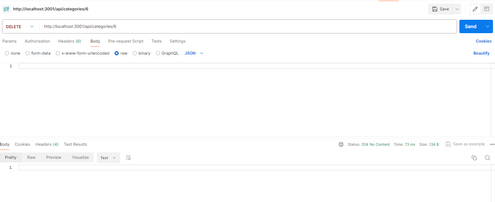
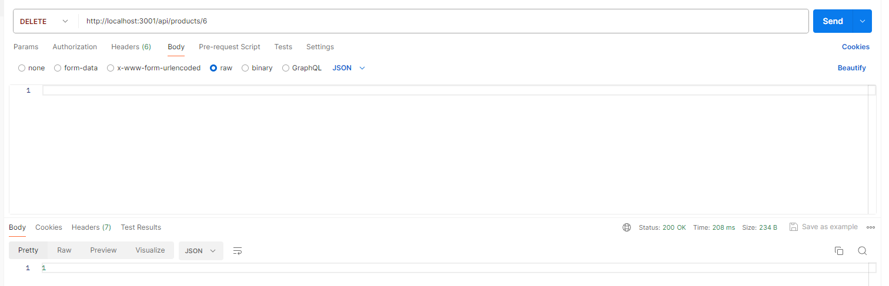
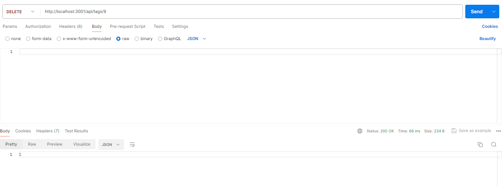
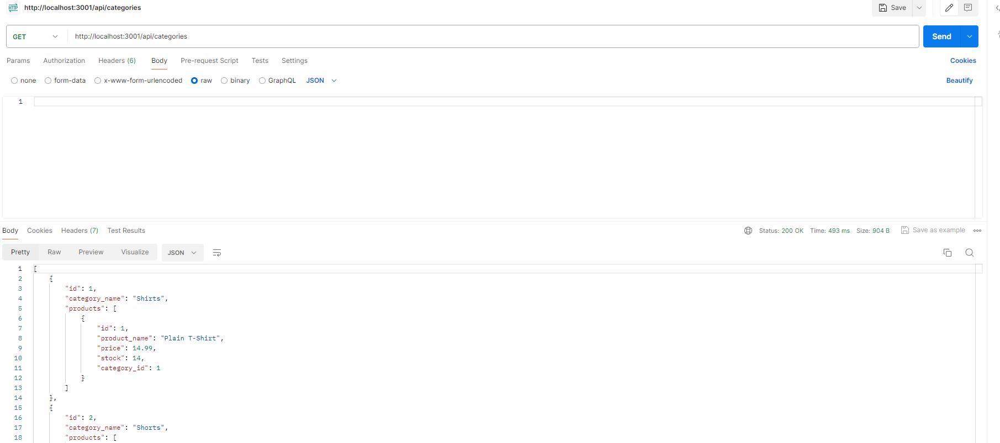
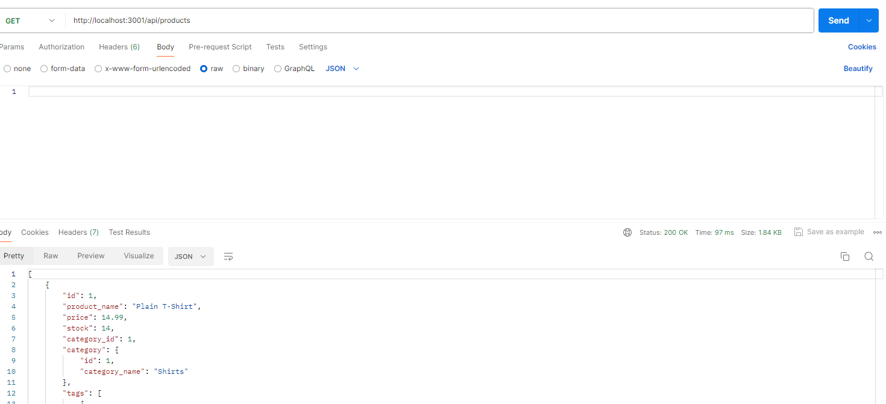
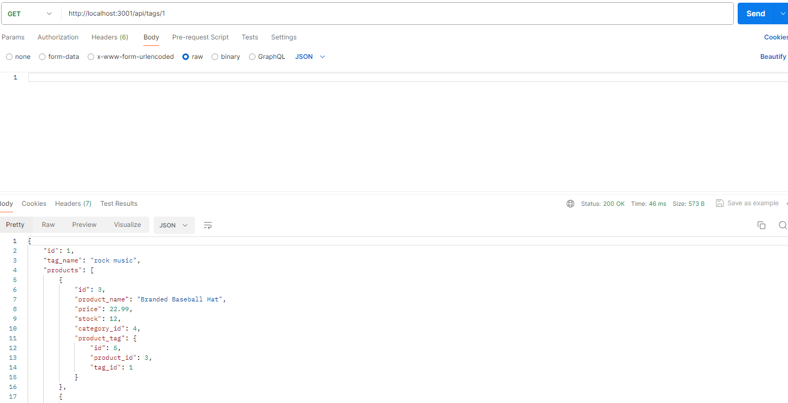
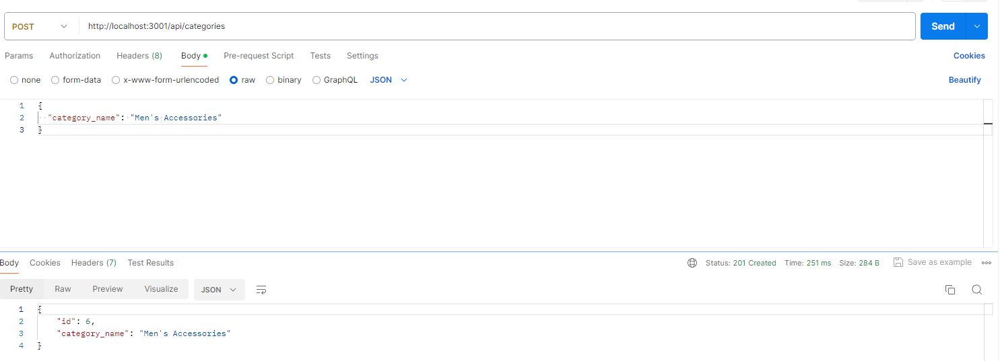
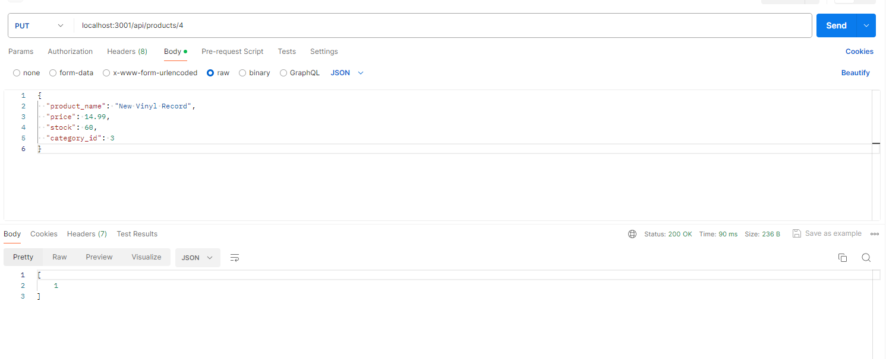
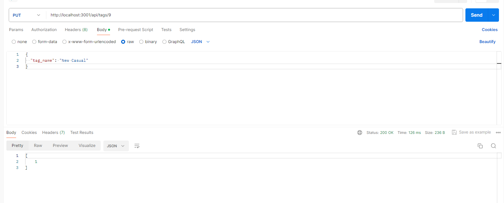

# 13 Object-Relational Mapping (ORM):E-Commerce-Software 

## Video Link.
https://watch.screencastify.com/v/9cg1eLTcDppgjQMy5IC8


[](https://www.gnu.org/licenses/gpl-3.0)


## Table of Contents
- [Description](#description)
- [Installation](#installation)
- [User Story](#user-story)
- [Acceptance Criteria](#acceptance-criteria)
- [Usage](#usage)
- [Tests](#tests)
- [Questions](#questions)
- [Task](#task)
- [License](#license)


## Description
Introducing our advanced e-commerce backend solution tailored for electronics businesses. Powered by Express.js and Sequelize, our platform enables efficient online transactions and streamlined inventory management.

Developers can create robust APIs that seamlessly interact with MySQL databases, ensuring optimal performance and scalability for product catalogs, orders, and customer interactions.

Our solution prioritizes developer productivity with comprehensive documentation and streamlined integration processes. Maximize your e-commerce venture's potential with our reliable and scalable backend solution.

## Installation
You’ll need to use the [MySQL2](https://www.npmjs.com/package/mysql2) and [Sequelize](https://www.npmjs.com/package/sequelize) packages to connect your Express.js API to a MySQL database and the [dotenv](https://www.npmjs.com/package/dotenv) package to use environment variables to store sensitive data.

. Clone the repository to your local machine:

 git clone https://github.com/your/repository.git

. Navigate to the project directory:
 cd repository-name

. Install the required dependencies:
 npm install

. Set up environment variables:
  Create a .env file in the project root and add the following configuration

 DB_USERNAME=your_database_username
 DB_PASSWORD=your_database_password
 DB_DATABASE=your_database_name
 DB_HOST=your_database_host (e.g., localhost)
 DB_PORT=your_database_port (e.g., 3306)

. Install required packages:

  npm install mysql2 sequelize dotenv

. Seed data into your database to set up initial records:
  npm run seed

. Start the server: 

  Launch the Express.js server to run your backend application:
  npm start

## Usage

To effectively use the ecommerce software backend, follow these steps:

. Testing API Endpoints:
Use tools like Postman or Insomnia commands to interact with the API endpoints for testing and validation.

. Authentication and Authorization:
Implement user authentication (e.g., JWT) and authorization to secure API routes and control access.

. Database Operations:
Utilize Sequelize ORM for database operations. Define models and perform CRUD (Create, Read, Update, Delete) operations on your MySQL database.

. Customize Route Handlers:

  Customize Express.js route handlers to process different HTTP requests:

  Use GET requests to fetch data from the database.
  Implement POST requests to create new records.
  Handle PUT requests to update existing resources.
  Use DELETE requests to remove data from the database.

. Error Handling:
Implement middleware for error handling to provide appropriate responses for different error scenarios.

. Deployment Preparation:
Configure environment variables in a .env file for database connection settings and other configurations required for deployment.

. Testing and Maintenance:
Continuously test the backend application, perform security audits, and maintain code quality for optimal performance and reliability.


## Task

Internet retail, also known as **e-commerce**, plays a significant role within the electronics industry, as it empowers businesses and consumers alike to conveniently engage in online buying and selling of electronic products. In the latest available data from 2021, the industry in the United States alone was estimated to have generated the substantial amount of US$2.54 trillion, according to the United Nations Conference on Trade and Development. E-commerce platforms like Shopify and WooCommerce provide a suite of services to businesses of all sizes. Due to the prevalence of these platforms, developers should understand the fundamental architecture of e-commerce sites.

Your task is to build the back end for an e-commerce site by modifying starter code. You’ll configure a working Express.js API to use Sequelize to interact with a MySQL database.

Because this application won’t be deployed, you’ll also need to provide a link to a walkthrough video that demonstrates its functionality and all of the acceptance criteria being met. You’ll need to submit a link to the video and add it to the readme of your project.

## User Story

```md
AS A manager at an internet retail company
I WANT a back end for my e-commerce website that uses the latest technologies
SO THAT my company can compete with other e-commerce companies
```

## Acceptance Criteria

```md
GIVEN a functional Express.js API
WHEN I add my database name, MySQL username, and MySQL password to an environment variable file
THEN I am able to connect to a database using Sequelize
WHEN I enter schema and seed commands
THEN a development database is created and is seeded with test data
WHEN I enter the command to invoke the application
THEN my server is started and the Sequelize models are synced to the MySQL database
WHEN I open API GET routes in Insomnia for categories, products, or tags
THEN the data for each of these routes is displayed in a formatted JSON
WHEN I test API POST, PUT, and DELETE routes in Insomnia
THEN I am able to successfully create, update, and delete data in my database
```

## Tests

Retrieve Categories, Products, and Tags

Use Postman to test GET routes for retrieving categories, products, and tags from the backend API.
GET:  http://localhost:3001/api/categories
      http://localhost:3001/api/tags
      http://localhost:3001/api/products


Retrieve Single Entity

Test GET routes to fetch a single category, product, or tag by ID using Postman.
GET:  http://localhost:3001/api/categories/1
      http://localhost:3001/api/tags/1
      http://localhost:3001/api/products/1

CRUD Operations

Demonstrate POST, PUT, and DELETE routes for modifying categories, products, and tags using Postman.

POST http://localhost:3001/api/categories
    http://localhost:3001/api/products

    http://localhost:3001/api/tags

PUT   http://localhost:3001/api/categories/6
      http://localhost:3001/api/tags/9
      http://localhost:3001/api/products/4


DELETE  http://localhost:3001/api/categories/6
        http://localhost:3001/api/tags/9
        http://localhost:3001/api/products/4

Usage Instruction:

Start Backend Server
.Ensure the backend server for your ecommerce software is running.
Open Postman

.Launch Postman or a similar API testing tool.

.Import Collection
Import the provided Postman collection containing sample API requests.

.Execute API Tests
Run the included requests in Postman to test various API endpoints (GET, POST, PUT, DELETE) for categories, products, and tags.

.Verify Responses
Validate that responses from the backend API match the expected behaviors based on the test scenarios.

IMAGES

















## Questions

- **GitHub**: [daisy isibor](https://github.com/daisy isibor)
- **Email**: daisyisibor9@duck.com

## License
  This project is licensed under the [GPLv3 License](https://www.gnu.org/licenses/gpl-3.0)